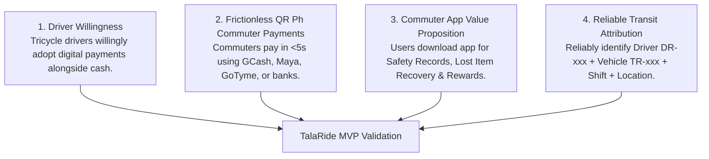
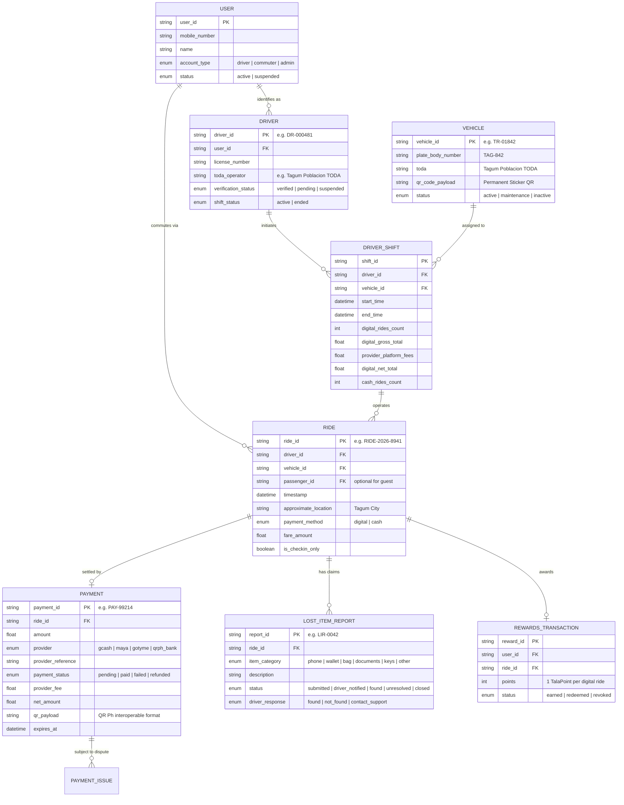
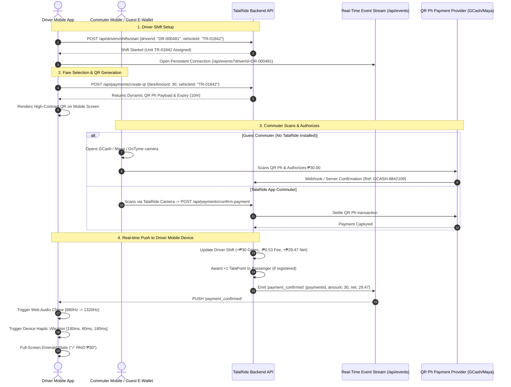

# TalaRide MVP: Project Goals, Domain Objects & Mobile App Integration

> **Core Philosophy**: *"Identify the ride and make payment effortless."*  
> TalaRide does not attempt to replace cash, nor does it force every passenger to install an app. Instead, it bridges riders, drivers, vehicles, fares, payment gateways, and safety ride records.

---

## 1. Project Objectives & Success Goals

The first version (MVP) of TalaRide is designed to prove four fundamental hypotheses:

### Primary Validation Goals
1. **Driver Digital Adoption**: Drivers easily generate QR codes and see instant, guaranteed visual/audio confirmation without peering at passenger phone screens.
2. **Interoperable Guest Experience**: Commuters without TalaRide scan with standard Philippine QR Ph e-wallets (GCash, Maya, ShopeePay, GoTyme, BDO, BPI) with zero friction.
3. **Safety & Lost Item Utility**: Commuters who pay cash can still scan permanent tricycle stickers to create a safety check-in record and retrieve forgotten belongings.
4. **Driver Net Payout Transparency**: Clear delineation between Gross Fare, Gateway Processing Fees (1.75%), and Net Driver Payout.

---

## 2. Core Domain Goal Objects

These data objects model the micro-transit ecosystem and are exposed through the backend API to native mobile apps and the web portal.

---

## 3. How the Backend Connects to the Mobile Apps

The TalaRide architecture supports both **Responsive Web/PWA** and **Native Mobile Apps (React Native, Flutter, iOS, Android, or Capacitor)**.

---

## 4. Mobile Hardware & Native OS Integrations

| Feature | Mobile Native API / Hardware | Purpose in TalaRide |
| :--- | :--- | :--- |
| **QR Code Scanner** | `react-native-camera` / `@capacitor/barcode-scanner` / Web `MediaDevices.getUserMedia()` | Scans dynamic payment QRs and permanent vehicle safety stickers. |
| **High-Contrast Display** | Dynamic brightness / Ambient Light Sensor API | Ensures the Driver Fare screen and QR code remain legible in tropical midday sunlight. |
| **Instant Audio Feedback** | Web Audio API / `react-native-sound` / AVPlayer | Plays dual-harmonic chime so drivers do not have to look down while driving. |
| **Tactile Vibration** | `navigator.vibrate` / `Vibration.vibrate()` | Triple-pulse haptic pattern confirming payment received in noisy traffic. |
| **Voluntary Location** | `navigator.geolocation` / CoreLocation / Google Play Services Location | Captures approximate city/street pickup coordinates solely upon voluntary permission. |
| **Offline Cache & Sync** | IndexedDB / SQLite / Room DB | Stashes voluntary cash ride check-ins when cell service drops, syncing when connectivity resumes. |

---

## 5. API Endpoint Contracts for Mobile Clients

### Authentication & Driver Terminal
- `POST /api/auth/otp-request`: Request 4-digit SMS OTP for driver or passenger.
- `POST /api/auth/otp-verify`: Verify OTP and establish driver session.
- `GET /api/drivers/:id`: Retrieve driver profile, TODA operator, active vehicle, and shift.
- `POST /api/drivers/shifts/start`: Bind driver to physical tricycle unit and start meter.
- `POST /api/drivers/shifts/end`: Close shift and generate summary payout report.
- `POST /api/drivers/cash-ride`: Record an offline cash trip into shift statistics.
- `GET /api/drivers/:id/summary`: Real-time daily dashboard: gross fare, provider fees, and net earnings.

### Dynamic QR Ph & Payment Rails
- `POST /api/payments/create-qr`: Generate dynamic QR Ph payload with 10-minute validity.
- `GET /api/payments/:id`: Poll or inspect payment status.
- `POST /api/payments/confirm-payment`: Process payment confirmation and trigger driver SSE alert.
- `POST /api/payments/issues`: Report double charges or dispute fares.

### Commuter Safety & History
- `POST /api/rides/safety-checkin`: Commuter scans permanent vehicle sticker to save safety record.
- `GET /api/rides`: Fetch personalized ride history (digital & cash).
- `GET /api/rides/:id`: Fetch ride receipt, assigned driver details, and pickup location.
- `POST /api/lost-items`: Submit lost item claims mediated by TalaRide (phone numbers kept private).
- `GET /api/rewards/:userId`: Retrieve TalaPoints balance, active promotional vouchers, and milestones.

### Real-Time Event Stream
- `GET /api/events?driverId=DR-xxxxx`: Server-Sent Events stream for instant driver chime & push notifications.
